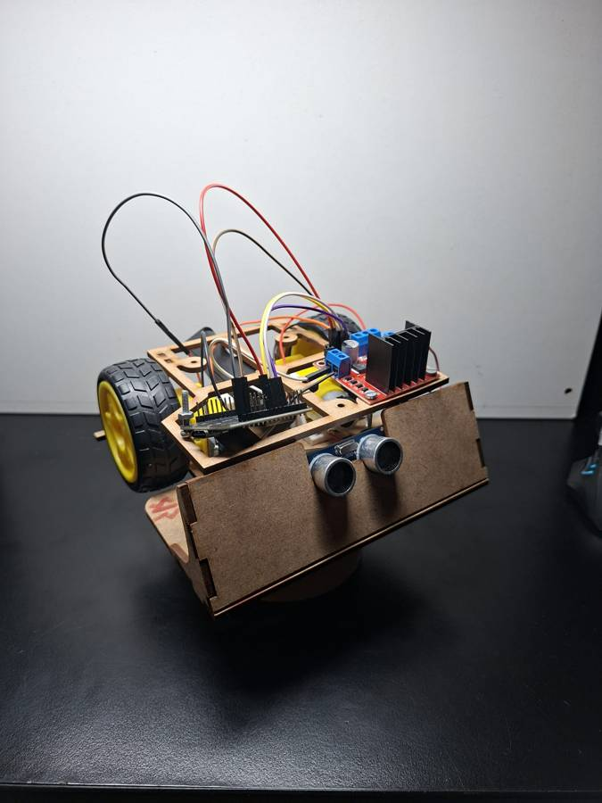
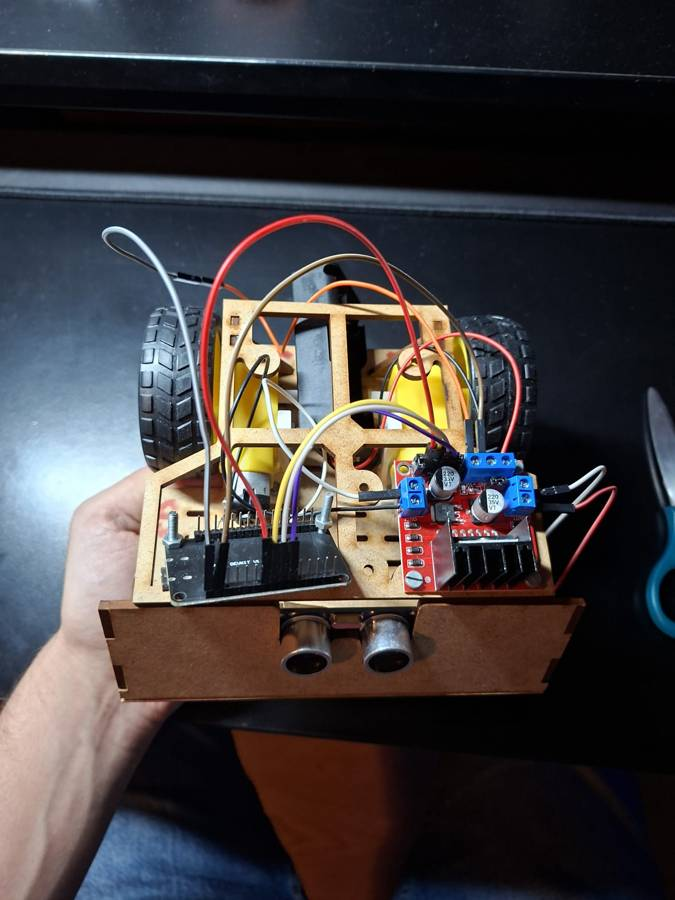
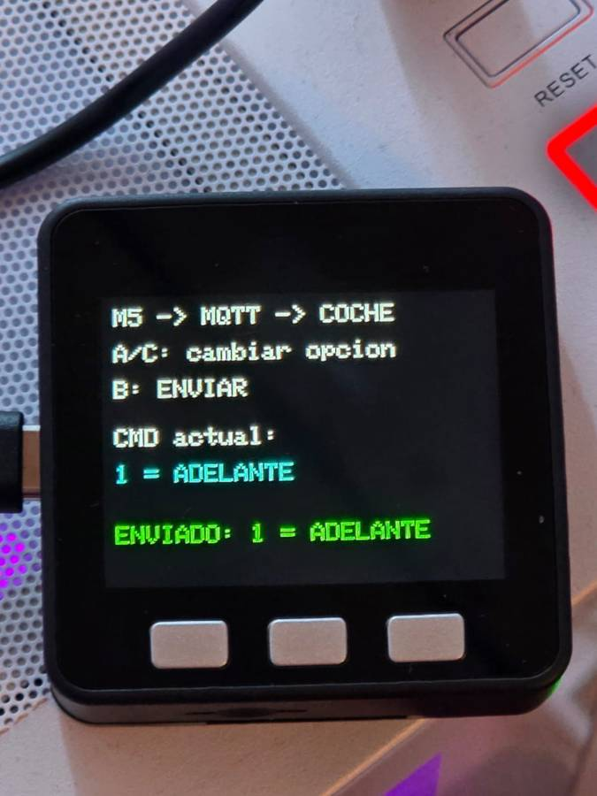

# Coche RC con ESP32

Coche de dos ruedas motrices controlado desde el móvil o desde un mando M5Stack, con un sensor **HC-SR04** que frena solo cuando tiene algo delante.

Se puede manejar de tres formas:

- con una app hecha en **MIT App Inventor**, por Bluetooth;
- con cualquier mando/app Bluetooth que envíe los comandos de abajo (las apps tipo *"Bluetooth RC Car"* de Android funcionan tal cual);
- con un **mando hecho con un M5Stack**, que manda los comandos por **WiFi + MQTT**.

<p align="center">
  
  
</p>

---

## Cómo funciona

- El ESP32 crea un Bluetooth clásico llamado **`CocheFranco`**. El móvil se empareja y manda letras: `F` adelante, `B` atrás, `S` parar…
- Cada 60 ms mide la distancia de frente:
  - **menos de 35 cm** → si va hacia delante, baja la velocidad a la mitad
  - **menos de 20 cm** → no deja avanzar y pita; **sí** deja ir marcha atrás y girar para salir
- Si se pierde la conexión Bluetooth, el coche **se para**.
- A la vez está conectado por WiFi a un broker **MQTT** y escucha el topic `francozimm/coche/cmd`, que es donde publica el mando M5Stack.
- También acepta los mismos comandos por USB (Monitor Serie a 115200), útil para probar sin móvil.

---

## Material

| Componente | Cantidad |
|---|---|
| ESP32 Dev Module | 1 |
| Driver de motores L298N (o similar) | 1 |
| Motores DC con reductora + ruedas | 2 |
| Rueda loca | 1 |
| Sensor ultrasónico HC-SR04 | 1 |
| Resistencias 1 kΩ y 2 kΩ (divisor para el ECHO) | 1 + 1 |
| Buzzer activo (opcional) | 1 |
| Batería 7,4 V (2× 18650) o portapilas | 1 |

---

## Conexiones

| ESP32 | Va a | Nota |
|---|---|---|
| GPIO 14 | L298N **ENA** | quitar el jumper de ENA |
| GPIO 27 | L298N **IN1** | |
| GPIO 26 | L298N **IN2** | |
| GPIO 32 | L298N **ENB** | quitar el jumper de ENB |
| GPIO 25 | L298N **IN3** | |
| GPIO 33 | L298N **IN4** | |
| GPIO 4  | HC-SR04 **TRIG** | |
| GPIO 18 | HC-SR04 **ECHO** | **a través del divisor** 1 kΩ / 2 kΩ (el ECHO da 5 V) |
| GPIO 23 | Buzzer (+) | opcional |
| GND | GND del L298N, del HC-SR04 y de la batería | **masa común** |
| VIN | 5 V del L298N | o alimentar el ESP32 por USB |

> Si un motor gira al revés, intercambia sus dos cables en el L298N (o IN1↔IN2 / IN3↔IN4 en el código).

---

## Comandos

| Carácter | Acción |
|---|---|
| `F` `B` `L` `R` | adelante, atrás, girar izquierda, girar derecha |
| `G` `I` | adelante-izquierda, adelante-derecha |
| `H` `J` | atrás-izquierda, atrás-derecha |
| `S` | parar |
| `0` … `9`, `q` | velocidad (de mínima a máxima) |
| `V` / `v` | bocina on / off |
| `D` | el coche responde con la distancia en cm |

### Comandos por MQTT (mando M5Stack)

| Mensaje | Acción |
|---|---|
| `0` | parar |
| `1` | adelante |
| `2` | atrás |
| `3` | izquierda |
| `4` | derecha |
| `5` | bocina on/off |

Por MQTT también se aceptan las letras de la tabla anterior.

---

## Mando con M5Stack (MQTT)

<p align="center">
  
</p>

Un **M5Stack Core** hace de mando: se conecta al WiFi y publica el comando elegido en el broker MQTT. El coche está suscrito al mismo topic y lo ejecuta.

```text
 M5Stack ──WiFi──► broker MQTT ──WiFi──► ESP32 del coche ──► motores
  (botones)        topic: francozimm/coche/cmd
```

- **A / C**: cambiar de opción (parar, adelante, atrás, izquierda, derecha, bocina).
- **B**: enviar al coche.
- En pantalla se ve el comando elegido, el último enviado y si el MQTT está conectado.

Código en [`m5_mando/m5_mando.ino`](m5_mando/m5_mando.ino). Necesita las librerías **M5Unified** y **PubSubClient**.

Por defecto usa el broker público `broker.hivemq.com`. Para algo más serio conviene un **Mosquitto** propio en la red local: basta con cambiar `MQTT_BROKER` en los dos códigos.

---

## App con MIT App Inventor

1. **Diseñador**: un `ListPicker` (para elegir el coche), botones *Adelante, Atrás, Izquierda, Derecha*, un `Slider` de 0 a 9 para la velocidad y un componente `BluetoothClient`.
2. **ListPicker.BeforePicking** → `Elements` = `BluetoothClient.AddressesAndNames`.
3. **ListPicker.AfterPicking** → `BluetoothClient.Connect(ListPicker.Selection)`.
4. Para cada botón:
   - `TouchDown` → `BluetoothClient.SendText("F")` (o `B`, `L`, `R`)
   - `TouchUp` → `BluetoothClient.SendText("S")`

   Así el coche solo se mueve mientras mantienes pulsado.
5. **Slider.PositionChanged** → `SendText` con el número redondeado (0–9).

El móvil tiene que estar **emparejado** antes con `CocheFranco` desde los ajustes de Bluetooth.

---

## Subir el código

**Coche**

1. Arduino IDE → instalar las placas **esp32 by Espressif** (Gestor de placas) y la librería **PubSubClient**.
2. Placa: **ESP32 Dev Module**.
3. *Herramientas → Partition Scheme* → **Huge APP (3MB No OTA)**. Bluetooth y WiFi juntos no caben en la partición por defecto.
4. Abrir `esp32_rc_car/esp32_rc_car.ino`, poner tu WiFi en `WIFI_SSID` / `WIFI_PASS` y subir.

Si solo quieres Bluetooth, pon `#define USAR_MQTT 0` y no hace falta ni la librería ni cambiar la partición.

**Mando**

1. Placa: **M5Stack Core** (paquete *M5Stack* en el Gestor de placas) y librerías **M5Unified** y **PubSubClient**.
2. Abrir `m5_mando/m5_mando.ino`, poner el mismo WiFi y subir.

Funciona con el core de ESP32 2.x y 3.x. Los valores que más se suelen tocar están al principio de cada archivo: `NOMBRE_BT`, `DISTANCIA_FRENO`, `DISTANCIA_AVISO`, `VELOCIDAD_MIN` y los datos del MQTT.

---

## Próximos pasos

- Vídeo del coche en movimiento
- Segunda versión del chasis
- Mando M5Stack con joystick o acelerómetro en vez de botones
- Modo autónomo (que esquive obstáculos solo)

---

Hecho por **Franco Zimmermann** · [@FrancoZimm](https://github.com/FrancoZimm)
